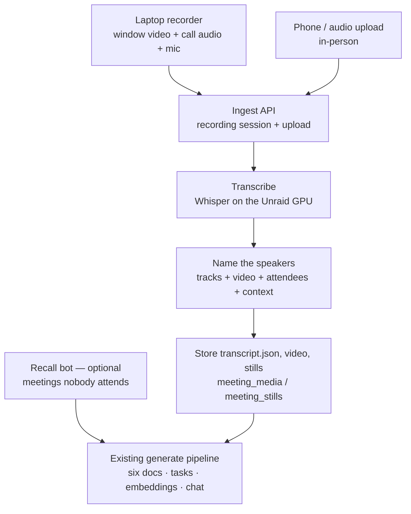

# Botless meeting capture — design

> **Status:** approved direction, 2026-09-25 (Brandon). Built first for the RelentNet
> instance (hq.relentnet.com); upstreamable to gracie proper.
> **Tracking:** Linear project `gracie` (P-REL-20), REL-313 … REL-318 — see §8.
> **Replaces:** Recall.ai as the *default* capture path. Recall stays as an optional
> input; none of its code is removed.

---

## 1. Decision

Capture meetings **without a bot in the call**:

- **Video calls** — a small cross-platform desktop recorder (**Tauri**) records the
  meeting app's window (video), the call audio, and the user's microphone as
  separate tracks, then uploads when the call ends.
- **In-person meetings** — a phone voice memo (or any audio file) is uploaded.
- **Meetings nobody attends** — the existing Recall.ai bot, as an optional input.

Everything captured flows into **one shared pipeline**: transcribe on the Unraid
GPU → name the speakers → the existing generation pipeline (six documents, tasks,
master record, embeddings, chat).

Recording is invisible to other participants. **RelentNet announces it verbally at
the start of every recorded meeting** (consent — some clients' states require
all-party consent). The recorder shows a persistent on-screen indicator while live.

## 2. Why

| | Recall bot (today) | Botless (this design) |
|---|---|---|
| Social cost | A bot visibly joins every client call | None — you say you're recording |
| In-person meetings | Impossible | Phone memo |
| Phone calls | Impossible | Laptop recorder or phone |
| Screen-share content | Stills via Recall media | Frames from our own video, read by a vision model |
| Speaker names | Exact, from the platform | Inferred from stacked signals (§5) — the hard part |
| Meetings nobody attends | Yes | No → keep Recall optional |
| Cost | ~$0.65 / meeting hour | ~$0 (own GPU) + R2 storage |
| External dependency | Recall API, public webhook | None beyond the LLM provider |

The market has moved the same way: the best-regarded note-takers capture device
audio instead of sending a bot, with a phone app for in-person meetings.

## 3. Architecture — separate capture from understanding

Capture sources differ; everything after the ingest API is shared. The Recall path
keeps its own route into `generate` and is untouched.

## 4. The contract every source meets

The generation pipeline needs exactly two things, both already defined:

1. **Transcript text** as `Speaker Name: words…` lines — the same shape
   `flattenRecallTranscript` produces (`packages/shared/src/recall/index.ts`).
   Today it enters via `GenerationJobPayload.transcriptOverride`, labelled a test
   path. **Promote it to a first-class input** (rename to `transcript`, update the
   comment and the `resolveTranscript` log line). No other pipeline change.
2. **For the meeting page** (optional but free):
   - `TranscriptSegment[]` (`{ start, end, speaker, text }`, seconds) written as
     `transcript.json`, keyed in `meeting_media.transcript_key` → click-to-seek.
   - The video object key in `meeting_media.video_key` → the player.
   - Screen-share frames in `meeting_stills` (`ts_seconds`, `object_key`).

Facts that make this cheap, verified against the code:
- `checkMeetingHappened` returns `proceed` when there is no `botJobId` — recorder
  meetings skip the Recall-based attendance gate with no change.
- `storeMeetingMedia` runs only when `botJobId` is set, so the ingest job writes
  `meeting_media` / `meeting_stills` itself and nothing collides.

## 5. Speaker naming — the hard part

Whisper produces text with timestamps and **no speakers**. Names come from stacking
signals, cheapest and most certain first:

| # | Signal | Certainty | Phase |
|---|---|---|---|
| 1 | **Track.** The mic track is the recording user. | 100% | P1 |
| 2 | **Attendee list.** The meeting's client contacts + names the user types turn "who is this?" into picking from a short list. A 1:1 call with one external attendee is fully named by signals 1–2. | High | P1 |
| 3 | **Context.** An LLM assigns remote speech to attendee names from what's said ("thanks Sloane", who owns the budget). Returns `Unknown speaker` rather than guess. | Medium | P1 |
| 4 | **Video.** Meeting apps highlight the active speaker's tile *with their name printed on it*. Sample a frame per remote turn; a vision model reads the highlighted name. | High | P3 |
| 5 | **Acoustic diarization** (pyannote on the GPU) splits the remote track into Speaker A/B/C before signals 3–4 name them. | High, with 3/4 | P4 |
| 6 | **Voice fingerprints** for recurring people (Brandon, Dan, repeat clients) — auto-identified. | High | P4 |

Without diarization (P1–P2), group calls fall back to `Remote participant` where
context can't decide. Documents still generate; attribution improves as phases land.

## 6. Components

### 6.1 Transcription service — Unraid GPU (P1)

- An **OpenAI-compatible faster-whisper server** (e.g. `speaches`; confirm current
  image and tag at build time) in a container on Unraid with the RTX 2080 Super.
  Model: `large-v3-turbo` (fits comfortably in 8 GB; ~20–40× realtime).
- **Reachable only over Tailscale** — never exposed through SWAG.
- The worker calls `POST {TRANSCRIBE_BASE_URL}/v1/audio/transcriptions` with
  `response_format=verbose_json` for segment timestamps. The same request works
  against hosted Whisper (Groq, ~$0.04/hr; OpenAI), so a hosted fallback is a
  base-URL + key swap — decide per privacy (see §9).
- **VRAM is shared with Ollama** (8 GB). Transcription waits its turn; if it becomes
  a problem, set Ollama's `keep_alive` lower.
- **Unraid rule (memory, 2026-09-23):** never build images on that box — pull or
  ship prebuilt ones. The server has ~3 GB RAM headroom.

### 6.2 Ingest API + job — gracie (P1)

- `POST /api/recordings` — creates the meeting (`source='recorder'`,
  `pipeline_status='processing'`, client + title + start time + attendees from the
  request) and returns **presigned multipart upload URLs** per track straight to
  R2/S3 (video is too large to stream through the app).
- `POST /api/recordings/:id/complete` — verifies the objects exist, enqueues
  `ingest-recording`.
- **Auth for the recorder:** a personal access token (hashed at rest, created in
  My Settings, revocable). The recorder cannot ride a browser Logto session;
  device-code sign-in can replace it later.
- **Worker job `ingest-recording`:** transcribe each audio track → name speakers (§5)
  → write `transcript.json`, `meeting_media`, and (video) extract stills → enqueue
  the existing `generate` job with the flattened transcript.
- **Web upload** (Phase 1's user-facing piece): an "Upload a recording" form on the
  meeting/calendar page, using the same two endpoints. This alone covers in-person
  meetings via a phone voice memo.
- **Migration:** add `'recorder'` to the `meeting_source` enum; a `personal_access_tokens`
  table.

### 6.3 Recorder app — Tauri (P2 audio, P3 video)

- **Stack:** Tauri v2, UI in React/TypeScript (same as gracie), a **small Rust core**
  for capture, encode, upload. Lives at `apps/recorder` in the monorepo.
- **Why Tauri, not Electron** (researched 2026-09-25): Electron's macOS system-audio
  capture silently records nothing when the app selects the window itself rather than
  via the system picker (electron/electron#52738, Aug 2026), and its Mac support
  depends on OS version and hidden flags (#47490). Tauri reaches the native APIs
  directly; the app is ~10 MB and lives in the tray.
- **Capture per OS:**
  - macOS 13+: ScreenCaptureKit — one stream gives the chosen window's video and the
    system audio. Mic via `cpal` as its own track.
  - Windows 10+: Windows.Graphics.Capture for the window; WASAPI loopback for system
    audio; mic via `cpal`.
  - Candidate crates: `scap` (MIT), `screencapturekit`, `cpal`. **No AGPL code** —
    gracie is proprietary; check every licence before adding it.
- **Encoding:** audio → Opus; video → H.264 via the platform hardware encoder,
  ~1 Mbps, screen-content tuned (~0.5 GB/hour). An ffmpeg sidecar (LGPL build) is an
  acceptable v1 shortcut.
- **v1 flow:** tray icon → Record → pick the meeting window → pick client + title
  (fetched from gracie) → Stop → resumable upload with progress → done.
- **Permissions:** macOS asks once for Screen Recording + Microphone.
- **Signing:** unsigned is fine for Brandon + Dan (one-time click-through on each OS).
  Distribution to customers needs an Apple Developer account ($99/yr) + a Windows
  code-signing certificate.

### 6.4 Recall — optional input

Unchanged. Its bot, webhooks and recovery stay as they are, used only for meetings
nobody from the team attends. REL-293 is demoted accordingly.

## 7. Storage and retention

- ~0.5 GB per meeting-hour of video; at 20 hours/week on R2 (~$0.015/GB-month,
  free egress) that is about $8/month after a year of accumulation.
- Proposed default: keep full video **90 days**, keep audio, transcript and stills
  indefinitely. Configurable in Settings. (Open question — §9.)

## 8. Phases

| Phase | Issues | Delivers | Useful on its own because |
|---|---|---|---|
| **P1** | REL-313, REL-314, REL-315 | Transcription service; ingest API + job; web audio upload; speaker naming signals 1–3 | In-person meetings work end to end from a phone memo |
| **P2** | REL-316 | Tauri recorder, audio only (mic + system tracks) | Every video call captured with "you vs them" attribution, no bot |
| **P3** | REL-317 | Recorder video; screen-share stills; active-speaker naming (signal 4) | Slides and drawings reach the documents; group calls get named |
| **P4** | REL-318 | Diarization + voice fingerprints; auto-detect meetings; signing for distribution | Attribution near Recall-quality; ready to ship to customers |

Recall (REL-293) is demoted to an optional input for meetings nobody attends.

## 9. Open questions

1. **Hosted fallback** when the Unraid box is offline — allowed (Groq), or strictly
   local (queue until it's back)? Privacy vs availability.
2. **Video retention** — 90 days, or keep everything?
3. **Dan's OS** — cross-platform is confirmed; the Windows capture path gets tested on
   Dan's machine.
4. **Attendee lists without a calendar** — v1 uses the client's contacts plus typed
   names; the CalDAV scanner (REL-294) would supply them automatically later.
